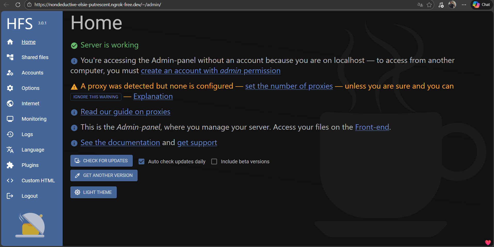
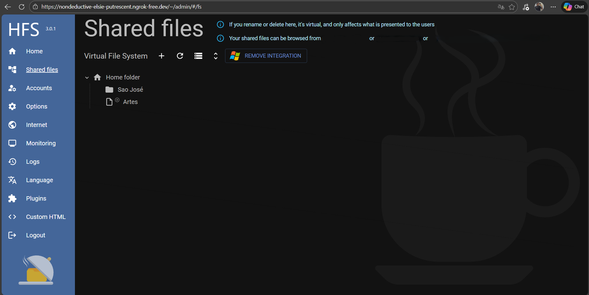
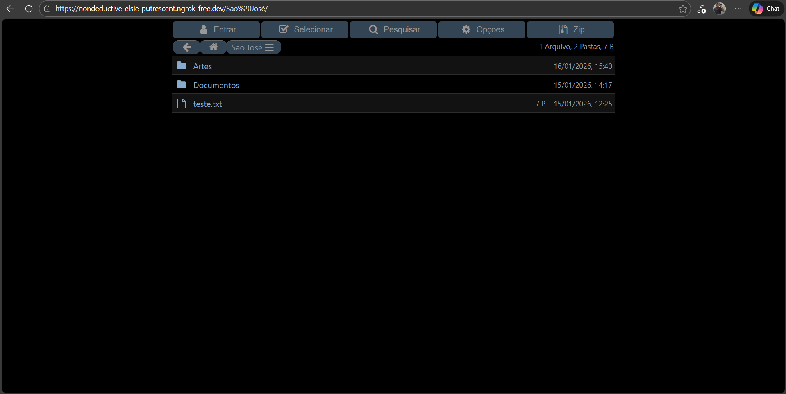

# Infrastructure Lab: Secure Remote Access via Network Tunneling

This project documents the implementation of a local file server accessible via the internet, overcoming physical infrastructure limitations while prioritizing network security and performance.

## The Challenge
The primary technical obstacle was the inability to perform **Port Forwarding** on the local router due to a lack of administrative access and the presence of **CGNAT** by the Internet Service Provider (ISP). The goal was to make a local service (HFS) externally available in a stable and secure manner.

## Implemented Solutions

### 1. Tunneling with ngrok
To bypass the impossibility of opening ports and the lack of a static public IP, I implemented **ngrok**.
**Function:** Established a secure tunnel (SSH Reverse Tunnel) connecting my local machine to ngrok’s nodes, creating an instant public endpoint.
**Benefit:** Eliminated the need for complex local firewall configurations and completely bypassed router-level restrictions.

### 2. DNS Management via Cloudflare & DuckDNS
To professionalize access and ensure persistence:
**DuckDNS:** Used as a Dynamic DNS (DDNS) service to map the dynamic IP when necessary.
**Cloudflare:** Configured as a proxy and DNS management layer. This allowed the use of a custom domain and masked the actual ngrok tunnel endpoint.

### 3. Security & Encryption (SSL/TLS)
Security was a core pillar of this setup:
Implemented **SSL/TLS termination** through Cloudflare, ensuring all traffic between the end-user and my local server is encrypted (HTTPS).
The architecture prevents direct IP exposure of my home network, mitigating potential DDoS or scanning attacks.

## Technical Documentation & Proof of Concept

Below are the visual evidences of the successful implementation and configuration:

### Infrastructure & Admin Panel

*Internal server dashboard showing connectivity status and proxy detection.*

### Virtual File System Setup

*Logical organization of the shared directory structure within the HFS environment.*

### Live Public Access (via ngrok)

*Proof of external accessibility using the secure ngrok-free.dev tunnel with SSL/TLS encryption.*

## Tech Stack
**Server:** HFS (Http File Server) for file management.
**Connectivity:** ngrok (Secure Tunneling).
**DNS & Performance:** Cloudflare, DuckDNS.
**Protocols:** TCP/IP, HTTP/HTTPS, DNS.

## Key Learning Outcomes
This lab allowed me to practically apply theoretical **Computer Science** and **Networking** concepts, such as:
Reverse Proxy operations and architecture.
DNS resolution and propagation.
Edge security and critical infrastructure obfuscation.
